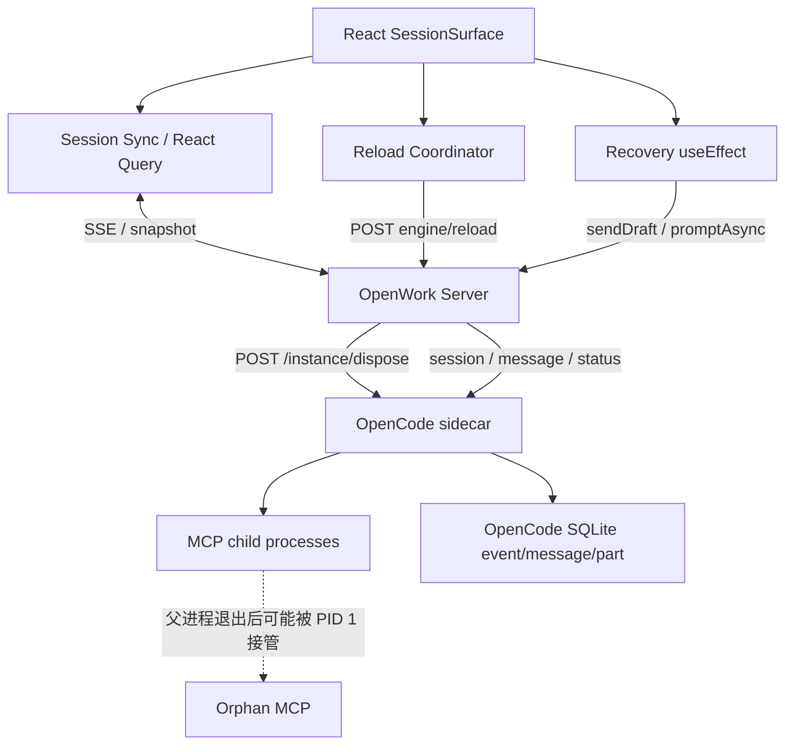
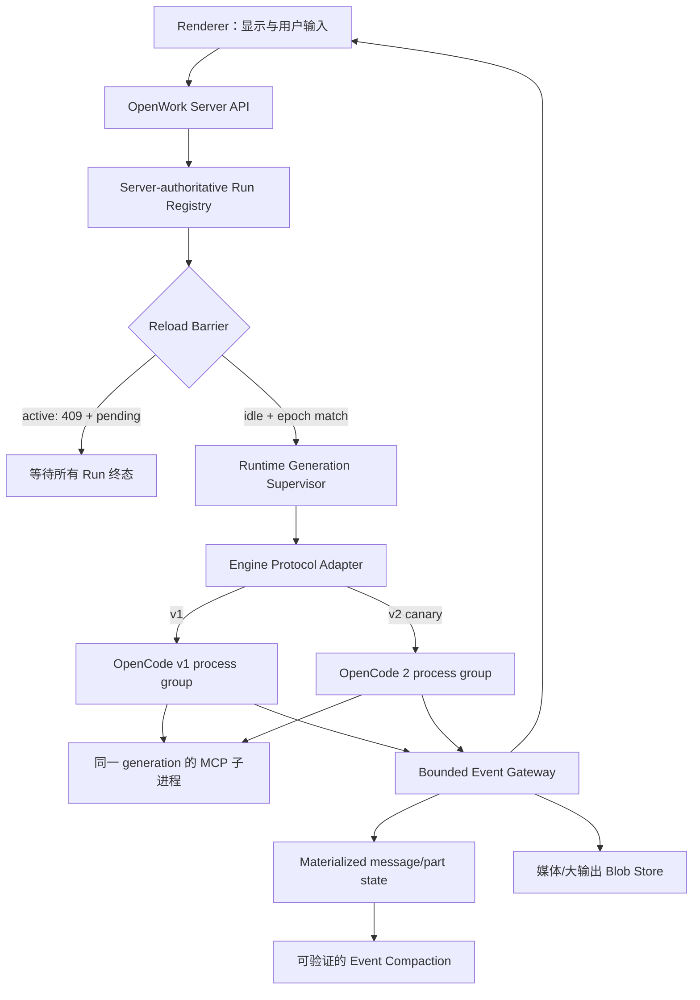

# WodeAppX（WodeAppX）运行时卡顿根因与整改方案

> 状态：执行中；P0-A / P0-B / P0-C / P0-E 已落地，P0-D 与 P1 尚待实施
> 日期：2026-07-29
> 范围：`wodeappx/` 的 OpenWork/OpenCode 桌面运行链路
> 非目标：本方案不要求把桌面端整体重写为 Rust，也不改 WodeApp `server/`、`runtime-server/`
> 兼容目标：当前 P0/P1 先在 OpenCode v1 运行时落地，但控制面不得绑定 v1 私有端点，须允许后续并行接入 OpenCode 2.0

## 1. 结论

本次卡顿的主因不是 React DOM 数量、CSS 动画或 Electron 本身，而是四类问题叠加后形成的运行时放大环：

1. **重载决策不具备服务端原子性**：Renderer 先根据本地会话状态判断“空闲”，稍后再调用 `/instance/dispose`；判断与执行之间存在竞态，OpenWork Server 也没有在执行点再次拒绝活跃任务。
2. **恢复逻辑会在 UI effect 中创建新模型 Turn**：空回复、卡住工具、孤儿工具恢复都会调用 `sendDraft()`；重挂载、切换会话或引擎重建后，组件内 `useRef` 计数重新初始化，可能再次触发自动续跑。
3. **只管理直接子进程，没有管理完整进程树**：Electron/OpenWork Server 会向直接启动的 OpenCode 发送 `SIGTERM`/`SIGKILL`，但 OpenCode 派生的 `npm exec ... lark-mcp` 可能被重新托管到 PID 1，后续重载继续产生新实例。
4. **事件负载和持久化无明确上限**：OpenCode `event` 表长期保存重复的 `message.updated`、`message.part.updated` 完整 JSON；大图、大视频或工具输出一旦以内联数据进入事件，就会同时放大 SQLite、SSE、JSON 解析、React Query 缓存和 Chromium 原生内存。

现有代码已经具备部分缓解：

- Session snapshot 限制到最近 72 条消息。
- snapshot hydrate 会移除大 `data:` URL、过长工具输出和完整 git patch。
- SSE delta 会通过 `requestAnimationFrame` 合并。
- reload coordinator 会参考 Renderer 内的 SSE 活动状态。
- Electron 会终止自己直接启动的运行时子进程。

这些缓解没有覆盖“服务端权威运行状态”“恢复幂等性”“完整进程树所有权”和“事件存储上限”，因此仍会出现严重卡顿。

推荐先修控制面和生命周期，再做存储压缩，最后才评估是否把某个常驻模块迁移到 Rust。单纯将 Electron 换成 Tauri，或把一个 Node/Bun 服务重写为 Rust，无法消除上述反馈环。

OpenCode 2.0 迁移不作为本轮止血的前置条件，但必须作为实现约束（见 §7.10）：Run Registry、Reload Barrier、Recovery Ledger、Runtime Generation、事件预算和可观测性使用 WodeAppX 自有的规范化契约；`/instance/dispose`、具体 SDK 类型、事件 shape、插件配置格式和 sidecar 命令只能存在于版本 adapter/bridge 内。这样当前修复可以先服务 v1，后续切换 v2 时不重写控制面。

### 1.1 2026-07-29 首轮实施状态

| 项目 | 状态 | 已落地内容 | 仍需完成 |
|---|---|---|---|
| P0-A UI 恢复 | 已完成 | stuck tool、empty visible reply、orphaned/stalled tool 只展示可见恢复提示；必须点击“继续任务”才创建 Turn；旧版遗留的静默恢复草稿在 auto-idle drain 前丢弃 | 后续如恢复策略重新自动化，必须先实现服务端 Recovery Ledger |
| P0-B Run Registry / Reload Barrier | 已完成 | 每 workspace 同步 run epoch、reload lease；`prompt_async` / `command` / `summarize` 在代理转发前登记；API reload 与内部 workspace bootstrap reload 均持有同一 lease，并两次读取引擎 live status；active、epoch 变化或并发 reload 均拒绝执行 | UI 可进一步在 reload 请求中携带 `expectedRunEpoch`，展示 active run 明细 |
| P0-C Runtime Generation | 已完成（Windows 实机待验） | Desktop 与 server-managed OpenCode 均生成 generation；Unix/macOS 使用独立进程组；Windows 当前 generation 使用 `taskkill /T`；generation marker 继承到 npm/MCP 后代并落盘，崩溃后只回收 ownership 可验证的进程 | Windows stale generation 需要 Job Object 才能在根 PID 消失后安全回收；未知历史进程仍不自动清理 |
| P0-D 诊断指标 | 进行中 | runtime status 暴露 generation snapshot；`GET /workspace/:id/runs`；**本地 PERF 采样器**（dev 默认开：10s / 30min ring + 角标 HUD + 导出诊断包，`wodeapp-perf-monitor`） | SSE/DB/React/recovery 完整计数仍可加厚；正式 soak 门禁仍见 §10.4 |
| P0-E Engine Adapter | 已完成首个 v1 slice | v1 status/reload 已进入 `OpenCodeV1Adapter`；Run Registry 和 route 只依赖 WodeAppX 自有类型；静态测试限制 `/instance/dispose` 的出现位置 | prompt/abort/event/snapshot 与 Extension Bridge 仍需按 MIG-01 继续收口 |
| P1 / P2 | 进行中 | PERF-05/06 已落地；PERF-07 首刀（part.updated+delta 同帧批处理 + activity 节流）已落地 | 历史 payload 外迁、VACUUM（仅磁盘压力）、虚拟化、MCP orphan、完整性能 soak |

本轮不会静默清理实施前已经存在、且没有 generation metadata 的历史 `lark-mcp` 等进程；首次历史清理由人工确认目标后单独执行。

## 2. 影响

### 2.1 用户影响

- 输入、滚动、切换会话明显掉帧或长时间无响应。
- 正在执行的任务可能在配置重载时被中断。
- 中断后的旧任务可能自动续跑，造成不可预期的工具调用、积分消耗或文件改动。
- 应用退出或引擎重启后，MCP 进程仍可能驻留。
- 使用时间越长、历史越多，SQLite 和 Renderer 内存压力越大。

### 2.2 工程影响

- 单纯优化 React 组件很难稳定改善，因为 CPU 和内存压力来自多层叠加。
- 仅看 Renderer 的 JS heap 会低估问题；Chromium 原生字符串、图片、IPC/SSE 缓冲和子进程 RSS 不一定计入 JS heap。
- 重启应用能暂时缓解，但会继续产生孤儿 MCP 和重复恢复，无法作为修复。

## 3. 诊断证据

以下数据来自 2026-07-29 对本机开发实例的只读检查。它们是单机事件样本，不代表所有用户的固定值，但足以证明当前没有资源上限和生命周期闭环。

### 3.1 运行时快照

| 指标 | 观测值 | 说明 |
|---|---:|---|
| Electron Renderer CPU | 68.9% | 单次 `ps` 快照；同一事件期间曾观察到约 80%–122% |
| Electron Renderer RSS | 6,677,888 KiB，约 6.37 GiB | 远高于当前页面可见 DOM 和 JS heap 所能解释的规模 |
| OpenCode sidecar CPU | 14.1% | 当前引擎实例 |
| OpenCode sidecar RSS | 1,052,176 KiB，约 1.00 GiB | 当前引擎实例 |
| `lark-mcp` 相关进程 | 58 个 | 包含 `npm exec` 包装进程和实际 Node 进程 |
| PID 1 下的 `lark-mcp` 根进程 | 28 个 | 说明原父进程退出后仍驻留 |
| `lark-mcp` 合计 RSS | 约 1.70 GiB | 只统计命令行精确匹配的飞书 MCP |

同一快照中，Electron 已运行约 1 小时，而当前 OpenCode sidecar 仅运行约 15 分钟；PID 1 下还能看到约 45–48 分钟前启动的 MCP 对。这与“引擎重启、直接父进程退出、MCP 留存”的链路一致。

### 3.2 OpenCode SQLite

数据库：

```text
~/Library/Application Support/com.differentai.openwork/
  openwork-runtime-data/<account-id>/xdg/data/opencode/opencode.db
```

只读统计：

| 指标 | 观测值 |
|---|---:|
| 数据库文件 | 2.1 GiB |
| `event` 行数 | 131,848 |
| `message.updated.1` | 33,073 行，JSON 合计约 1,117.4 MiB |
| `message.part.updated.1` | 86,629 行，JSON 合计约 453.0 MiB |
| 最大单条 `message.part.updated.1` | 186,670,002 字节，约 178 MiB |
| `session.updated.1` | 10,639 行，JSON 合计约 130.5 MiB |
| `message` | 9,380 行，JSON 合计约 113.8 MiB |
| `part` | 44,564 行，JSON 合计约 193.7 MiB |
| `session` | 545 行 |

结论：

- 最终 `message`/`part` 状态合计远小于 `event` 历史。
- `event` 中存在高频、重复的完整状态快照。
- 单条 178 MiB 事件说明媒体或大型工具负载曾直接进入事件链。
- 即使 Renderer 只 hydrate 最近 72 条消息，持久化、查询、SSE 或调试路径仍可能处理大事件。

### 3.3 自动续跑

数据库中精确匹配系统自动续跑标记的记录：

| 指标 | 观测值 |
|---|---:|
| 出现自动续跑标记的 session | 22 |
| 自动续跑标记 part | 57 |
| 单一 session 最大次数 | 12 |

这证明“最多重试 1–2 次”的组件内限制没有形成跨重挂载、跨引擎代际的持久化幂等边界。

### 3.4 UI 排除项

事件期间曾检查当前可见页面：

- DOM 节点约 1,275 个。
- 页面只有少量小图片。
- 空闲时事件循环延迟约 0.86 ms。
- 没有任务风暴时，Renderer CPU 可回落到约 0%–3%。

因此，普通 DOM 规模不是主根因。消息渲染和 React 更新仍需要优化，但其优先级低于任务、重载、进程和事件负载的控制面修复。

## 4. 当前运行链路



反馈环：

```text
多个任务或旧任务自动恢复
  -> Agent 修改 Skill/MCP/Config
  -> reload-required
  -> Renderer 判断“看起来空闲”
  -> /instance/dispose
  -> 活跃 Turn 被中断，MCP 子进程可能残留
  -> UI recovery 发现空回复/孤儿工具
  -> 自动发送新的 continue Turn
  -> 再次修改配置或产生大量事件
  -> 下一轮 reload
```

## 5. 根因详解

### 5.1 根因 A：Reload barrier 不是服务端权威边界

当前 Renderer 中的 `ReloadCoordinatorProvider` 已经同时检查：

- 会话列表推导出的 `activeSessions`
- `useSessionActivityStore` 的实时 `thinking/responding/compacting/waiting`
- onboarding 是否可见

但仍有三处缺口：

1. Renderer 的状态是缓存/投影，不是执行引擎的原子状态。
2. debounce 定时器触发时只重查 `useSessionActivityStore`，无法保证所有 workspace、child session、等待审批和刚启动的 Turn 都已进入该 store。
3. OpenWork Server 的 `POST /workspace/:id/engine/reload` 直接执行 `reloadOpencodeEngine()`，没有在 `/instance/dispose` 前做服务端 active-run compare-and-set。

因此，即使 UI 的判断大多数时候正确，仍可能在“判断空闲”和“执行 dispose”之间启动新 Turn。

涉及位置：

- `apps/app/src/react-app/shell/reload-coordinator.tsx`
  - `hasLiveSessionActivity`
  - `reloadIdle`
  - 自动重载 `useEffect`
- `apps/app/src/react-app/shell/session-route.tsx`
  - `activeReloadBlockingSessions`
- `apps/app/src/react-app/shell/use-engine-reload.ts`
  - `reloadWorkspaceEngineFromUi`
- `apps/server/src/routes/operations.ts`
  - `POST /workspace/:id/engine/reload`
- `apps/server/src/server.ts`
  - `reloadOpencodeEngine`

### 5.2 根因 B：UI 渲染生命周期拥有“创建新 Turn”的副作用

`SessionSurface` 中存在三类自动恢复：

- stuck empty pending tool
- empty visible reply
- orphaned running tool

其中 orphan recovery 在父 session idle 后调用 `sendDraft()`。计数器和已恢复 part 集合保存在组件 `useRef` 中；组件重挂载或应用重启后，这些值会重新创建。数据库中的旧 `running` part 仍然存在时，同一历史异常可再次满足恢复条件。

问题不是“重试次数太大”，而是恢复所有权放错了：

- UI mount/unmount 不应决定是否创建一个计费、可写文件、可调用工具的新 Turn。
- 幂等记录必须跨 Renderer 重挂载和引擎重建持久化。
- recovery 必须绑定明确的 `sessionId + turnId + partId + reason + engineGeneration`。

涉及位置：

- `apps/app/src/react-app/domains/session/surface/session-surface.tsx`
- `apps/app/src/react-app/domains/session/surface/stuck-tool-recovery.ts`
- `apps/app/src/react-app/domains/session/surface/empty-visible-reply-recovery.ts`
- `apps/app/src/react-app/domains/session/surface/orphaned-running-tool-recovery.ts`

### 5.3 根因 C：直接子进程终止不等于完整进程树回收

当前 `spawnManagedChild()` 和 `managed-opencode.ts`：

- 保存直接 `ChildProcess`
- 先发送 `SIGTERM`
- 超时后发送 `SIGKILL`

但没有为每个 runtime generation 建立可回收的进程组/Windows Job Object，也没有持久化所有派生 MCP 的所有权。`cleanupPackagedSidecars()` 只在 packaged 模式执行，而且主要匹配本应用 bundle 内的 sidecar 命令；`npm exec @larksuiteoapi/lark-mcp` 不属于该匹配集合。

结果：

- OpenCode 被杀死后，MCP 继续运行。
- MCP 被 PID 1 接管，新的 OpenCode 又启动一套 MCP。
- 多次重载后，进程数和 RSS 线性增长。

涉及位置：

- `apps/desktop/electron/runtime.mjs`
  - `spawnManagedChild`
  - `stopChild`
  - `cleanupPackagedSidecars`
  - `stopAllRuntimeChildren`
- `apps/server/src/managed-opencode.ts`
  - `startManagedOpencode`
  - `close`
- OpenCode MCP 启动/关闭实现；若上游不提供完整 teardown，需要 WodeAppX patch 或 wrapper

### 5.4 根因 D：事件存储与传输允许无界大负载

现有优化主要覆盖 snapshot：

- snapshot 只取最近 72 条消息。
- server read model 会移除大 `data:` URL 和完整 patch。
- Renderer 的 `slimOpenworkSessionSnapshot()` 会再次裁剪。

但 live `message.part.updated` 仍先以完整 JSON 进入 SSE 解析和 `toFileUIPart()`。如果 part 内含大 `data:` URL 或巨大工具输出，裁剪发生得太晚或只发生在 snapshot 路径。

同时，OpenCode `event` 表保留每次更新的完整 JSON，没有 WodeAppX 侧的：

- 单事件大小限制
- 媒体 out-of-band 存储
- terminal state snapshot 后的安全 compaction
- 数据库增长预算和告警

涉及位置：

- `apps/app/src/react-app/domains/session/sync/session-sync.ts`
  - `applyEvent`
  - `toFileUIPart`
  - `message.part.updated`
- `apps/app/src/react-app/domains/wodeapp/wodeapp-session-snapshot-slim.ts`
- `apps/server/src/session-read-model.ts`
- OpenCode SQLite event writer；不应直接在 WodeAppX 中无条件删除事件

### 5.5 放大因素：多会话和多副本状态

在多个 session/child agent 同时活动时，同一逻辑事件可能经过：

1. OpenCode event JSON
2. SSE 字符串和解析对象
3. Session sync 映射对象
4. React Query transcript cache
5. Snapshot cache
6. Rendered snapshot/state
7. Markdown/代码高亮派生结构

现有的 delta 合并和 72-message snapshot 已降低一部分开销，但大 payload、多个活跃 session 和恢复/重载循环仍会把这些副本放大。

## 6. 目标架构



必须满足的架构不变式：

1. **读取会话不等于恢复执行。**
2. **只有用户动作或服务端显式 recovery command 能创建 Turn。**
3. **Renderer 不能单独批准 engine reload。**
4. **Reload 执行点必须原子检查 active run epoch。**
5. **一个 runtime generation 拥有并最终回收其完整进程树。**
6. **媒体字节和超大工具输出不进入普通消息事件。**
7. **任何自动恢复对同一失败 Turn 至多执行一次，并可审计。**
8. **数据库、事件、内存、并发和进程数都有硬上限或告警阈值。**
9. **控制面只依赖规范化 Engine 契约，不直接依赖 OpenCode v1/v2 的端点、SDK 类型或事件 shape。**

## 7. 改动方案与位置

> `vendor/openwork/` 是生成结果。正式改动必须落到 `integrations/openwork/fork/`、对应 integration source，或 `scripts/apply-openwork-integration.mjs`；禁止只改 vendor。

### 7.0 源码所有权与落点矩阵

本节涉及的文件分属三类落点。下表已经按首轮实施后的真相源更新。

| 文件 | 当前状态 | 改动落点 |
|---|---|---|
| `apps/app/.../surface/session-surface.tsx` 及三个 `*-recovery.ts` | fork 已有覆盖 | 直接编辑 `integrations/openwork/fork/` 对应文件 |
| `apps/app/.../sync/session-sync.ts`、`wodeapp-session-snapshot-slim.ts` | fork 已有覆盖 | 直接编辑 fork 对应文件 |
| `apps/app/.../shell/reload-coordinator.tsx`、`use-engine-reload.ts` | 仅 vendor 存在，fork 未覆盖 | 新增完整 fork override，或通过 patcher 做小范围可验证注入 |
| `apps/server/src/routes/operations.ts` | 完整 fork override 已新增 | `integrations/openwork/fork/apps/server/src/routes/operations.ts` |
| `apps/server/src/server.ts` | vendor-only 上游文件 | 由 `applyRunControlServerPatch()` 做幂等注入 |
| `apps/server/src/managed-opencode.ts` | 完整 fork override 已新增 | fork 文件 + `managed-process-tree.ts` |
| `apps/desktop/electron/runtime.mjs` | vendor-only 上游文件 | 由 `applyRuntimeGenerationSupervisorPatch()` 注入；独立 supervisor 契约在 fork-owned `runtime-generation.mjs` |
| `run-registry.ts` | 已新增 | `integrations/openwork/fork/apps/server/src/run-registry.ts` |
| `recovery-ledger.ts`、`routes/recovery.ts` | 未新增 | 当前 P0-A 已取消静默自动恢复；重新引入自动恢复前再实现 |
| `engine-types.ts`、`opencode-v1-adapter.ts` | 已新增 | `integrations/openwork/fork/apps/server/src/engine/` |
| `engine-extension-bridge.ts`、v2 adapter | 未新增 | MIG-01 后续阶段 |

选择"完整 fork override"还是"patcher 注入"按文件改动面决定：改动集中、可幂等重放的优先 patcher；逻辑重写面广的新增完整 override。两者都必须通过 `pnpm openwork:patch` 二次执行验证幂等。

### 7.1 PERF-01：服务端 Run Registry

优先级：P0

新增服务端权威状态：

```ts
type RunState =
  | "starting"
  | "active"
  | "waiting_permission"
  | "waiting_question"
  | "compacting"
  | "cancelling"
  | "completed"
  | "failed"
  | "interrupted";

type RunRecord = {
  workspaceId: string;
  sessionId: string;
  turnId: string;
  state: RunState;
  epoch: number;
  updatedAt: number;
};
```

改动位置：

- 新增 `integrations/openwork/fork/apps/server/src/run-registry.ts`
- `apps/server/src/routes/sessions.ts`
  - prompt/abort/status 路径更新 registry
- `apps/server/src/routes/operations.ts`
  - reload 在服务端读取 registry
- `apps/app/src/react-app/domains/session/status/session-activity-store.ts`
  - 只作为 UI 投影，不再作为最终 reload gate

接口建议：

```text
GET  /workspace/:id/runs
POST /workspace/:id/engine/reload
     body: { expectedRunEpoch, force?: false }
```

服务端行为：

- 存在非终态 run 时返回 `409 active_runs`，附 session/turn/state 摘要。
- `expectedRunEpoch` 不匹配时返回 `409 run_epoch_changed`。
- waiting permission/question 仍属于 active，不能自动 dispose。
- `force=true` 只能来自显式用户确认，不用于自动重载。

### 7.2 PERF-02：Reload 分级与单飞

优先级：P0

把变更分为：

| 级别 | 示例 | 行为 |
|---|---|---|
| Hot apply | 已支持动态 push 的 MCP 开关/配置 | 不调用 `/instance/dispose` |
| Deferred reload | Skill、Plugin、Agent、Command 等确需重建的变更 | 标记 pending，所有 run 终态后只执行一次 |
| Full restart | OpenCode 不可达、协议错误、进程失效 | 显式 supervisor restart |

要求：

- reload 使用 server-side singleflight，同一 workspace 同时最多一个。
- 多次变更合并为一个 generation。
- reload 前、dispose 后、MCP 重连后分别记录 generation 和耗时。
- `/instance/dispose` 成功不等于 reload 完成；必须等待新 generation ready 和 MCP teardown/startup 收敛。

改动位置：

- `apps/app/src/react-app/shell/reload-coordinator.tsx`
  - 只负责显示 pending 和发起请求
- `apps/app/src/react-app/shell/use-engine-reload.ts`
  - 处理 `409 active_runs`，不做本地猜测
- `apps/server/src/routes/operations.ts`
- `apps/server/src/server.ts`
  - `reloadOpencodeEngine`
- `apps/server/src/openwork-runtime-config.ts`
- `apps/server/src/mcp.ts`
  - 已可动态更新的 MCP 不触发 cold reload

### 7.3 PERF-03：移除 UI 静默自动续跑

优先级：P0

第一阶段的安全策略：

- 保留异常检测和“未完成”UI。
- 删除/关闭 effect 内的 `sendDraft()`。
- 显示明确的“继续任务”操作，由用户点击后创建新 Turn。
- stuck tool 处于真实 busy 时仍允许受控 abort，但不得随后由 mount 自动发送。

第二阶段如必须自动恢复：

- 在 OpenWork Server 创建持久化 recovery ledger。
- 幂等键：

```text
sessionId + sourceTurnId + partId + reason + engineGeneration
```

- 状态：`eligible -> claimed -> attempted -> succeeded/failed/suppressed`
- 同一幂等键最多一次。
- 必须有全局/每 session circuit breaker。
- 自动 recovery 需要审计记录和可见通知，不伪装成用户消息。

改动位置：

- `apps/app/src/react-app/domains/session/surface/session-surface.tsx`
- 三个 `*-recovery.ts`
- 新增 `apps/server/src/recovery-ledger.ts`
- 新增 `apps/server/src/routes/recovery.ts`

### 7.4 PERF-04：Runtime Generation 和进程树回收

优先级：P0

每次启动 runtime 生成：

```text
generationId
ownerKind: "desktop" | "server" | "orchestrator"
rootPid
processGroupId
startedAt
executablePath
workspace/account scope
child process inventory
```

**所有权核心不变式：每个 runtime generation 只能有一个最外层 owner。** 禁止 Electron 与 OpenWork Server 对同一棵进程树重复托管、重复拉起或重复终止。owner 按运行模式确定，不固定二选一：

| 运行模式 | 最外层 owner | 持有内容 |
|---|---|---|
| 桌面 direct / orchestrator 模式 | Electron `runtime.mjs` | runtime generation、根进程组 |
| headless / embedded server 模式（`manageOpencode`） | OpenWork Server `managed-opencode.ts` | 对应 OpenCode 进程组 |

两层都需要实现相同的进程组语义，但任意时刻只有一层对给定 generation 生效；模式切换时必须显式移交或完整回收 ownership，不允许双层并发持有。

Unix/macOS：

- 将 OpenCode/Orchestrator 放入独立进程组。
- 停止时先请求协议级 shutdown。
- 超时后向整个进程组发送 `SIGTERM`，再 `SIGKILL`。
- 验证进程组为空后才能启动下一 generation。

Windows：

- 使用 Job Object，或受控 `taskkill /T` 作为兼容路径。
- PID 必须同时校验启动时间和可执行文件，避免 PID 复用误杀。

MCP：

- 尽量由 OpenCode 暴露 MCP shutdown/close 完成协议级退出。
- 无法保证时，通过 supervisor wrapper 让 MCP 保持在同一 generation 进程组。
- 禁止只按命令名称全局扫描并杀进程；只回收本 generation 明确拥有的 PID/process group。

改动位置：

- `integrations/openwork/fork/apps/desktop/electron/runtime.mjs`
- `integrations/openwork/fork/apps/server/src/managed-opencode.ts`
- `apps/desktop/electron/main.mjs`
  - quit/restart 等待 supervisor 完成
- `scripts/apply-openwork-integration.mjs`
- 对应 `runtime.test.mjs`、`managed-opencode` 测试

### 7.5 PERF-05：事件负载硬限制和媒体外置

优先级：P1（**写入闸门已落地 2026-08-03；历史迁移仍 P2**）

在事件进入 Renderer 前统一 sanitize（已有）：

- `data:image/*`、`data:video/*`、`data:audio/*` 超过 2 KiB 时不得进入 React Query。
- 本地附件先 materialize 为本地 asset/path 引用。
- 远程媒体保留 HTTPS URL/asset ID。
- 工具输出超过阈值时保存到 artifact/blob，消息只保留摘要、大小、hash 和读取句柄。
- live SSE 和 snapshot 使用同一 slimming 函数，不能只优化 hydrate。

**写入前外置（server/engine，2026-08-03）**：

- 模块：`integrations/opencode/event-payload-externalize.ts`（经 `patch-opencode-dynamic-tools.mjs` 拷入 OpenCode）。
- 闸门：`Session.updatePart` 发布 durable `message.part.updated` **之前**调用 `externalizePartForEventStore`。
- 入站：`prompt.resolvePart` 对 video/audio/PDF **不再**拼 `data:` base64，直接写 `~/.wodeappx/session-artifacts`（`0700`/`0600`）并保留 `file://`。
- 规则：video/audio/PDF 一律外置；其它 `data:` > 2 KiB 外置；tool `output`/`error` ≥ 256 KiB 外置（留预览 + path/sha256/readHint）；外置后 part JSON 仍 > 2 MiB → **抛错拒写**（不静默截断）。
- 指标：`externalized_bytes` / `externalized_count` / `max_event_bytes` / `payload_rejected`（`getEventPayloadMetrics()`）。
- 回读：`readExternalizedArtifact(path, { offset, maxChars })`。
- Artifact GC：`scripts/wodeappx-session-artifact-gc.mjs`（默认 dry-run；TTL 30d + `.tmp` 24h + **session 软配额 512MiB** 优先清最老未引用；扫描不全拒删；`--apply --idle-confirmed`）。
- **生效**：需重建 patched OpenCode sidecar（`build-patched-opencode` / 打包流程）；仅改 Renderer 不够。
- **非目标（本刀）**：历史 178 MiB 事件迁移、VACUUM、Server 定时维护。
- **artifact 生命周期（2026-08-03）**：`scripts/wodeappx-session-artifact-gc.mjs` 默认只读 dry-run；它扫描 event DB 中的 `file://`/`artifactRef` 引用，仅在引用扫描完整且显式传入 `--apply --idle-confirmed` 时删除过期、未引用文件。不会在桌面启动或正常会话路径中自动删除；扫描失败拒绝 destructive GC。

初始预算：

| 项目 | 预算 |
|---|---:|
| 单个普通 SSE event | <= 512 KiB |
| 硬拒绝/外置阈值 | 2 MiB |
| inline media bytes | 0（video/audio/PDF）；其它 data: >2 KiB |
| tool output 外置 | >= 256 KiB |
| Renderer 内工具文本 | 默认 <= 6,000 字符 |
| Renderer 首屏消息 | 72 条，后续按需加载 |

改动位置：

- `integrations/opencode/event-payload-externalize.ts`（+ OpenCode `session.ts` / `prompt.ts` patch）
- `apps/app/src/react-app/domains/session/sync/session-sync.ts`
  - 在 `applyEvent()` 最前面 sanitize
  - `toFileUIPart()` 不接收大 data URL
- `apps/app/src/react-app/domains/wodeapp/wodeapp-session-snapshot-slim.ts`
  - 抽为 live/snapshot 共用 contract
- `apps/server/src/session-read-model.ts`
- 本地 asset/artifact 路由
- 各 WodeAppX-owned tool result wrapper

### 7.6 PERF-06：事件 compaction 和数据库维护

优先级：P1

不能直接按时间删除 OpenCode `event` 表，因为必须先证明 `message`、`part`、`session` materialized state 足以恢复。

实施顺序：

1. ~~增加只读审计工具，按类型统计行数、字节数和最大 event。~~ **已落地（2026-07-31）**：`scripts/wodeappx-event-db-audit.mjs`（`pnpm test:event-db-audit`）。首轮实测：event 17.0 万行 / 3018 MiB，库文件 3625 MiB（触发 >1 GiB 维护提示），单 event >2 MiB 共 50 个（最大 178 MiB），按规则可回收 50.6% 行 / 2316 MiB。
2. ~~对媒体/大工具输出先完成外置，阻止继续增长。~~ **写入闸门已落地（2026-08-03）**：见 §7.5「写入前外置」。Renderer PERF-05 slim 仍保留作防御。历史巨包迁移仍为 P2。
3. ~~在复制数据库上验证 compaction~~ **已落地（2026-07-31）**：`scripts/wodeappx-event-db-compaction-dryrun.mjs`（`pnpm test:event-db-compaction:dryrun`）。规则：仅 `message.updated.%`/`message.part.updated.%` 每实体保留 rowid 最大行，其余类型与 NULL 实体全保留，`event_sequence` 不动。复制库验证结果：删除 8.6 万行后 session/message/part/todo 投影指纹一致、FK 零违例、integrity ok、VACUUM 回收 1279 MiB。
   - ~~仍待证明（开 feature flag 前的必要条件）~~ **已证明（2026-07-31）**：`scripts/wodeappx-event-db-compaction-smoke.mjs`（`pnpm test:event-db-compaction:smoke`）用 compaction 副本库启动真实引擎沙箱（独立 XDG/端口/凭据，剔除 mcp）实测 6/6 通过：引擎正常启动（583 session）、会话列表可读、最重压缩会话 1046 条消息与库内计数一致且正文完整、续跑一轮成功（seq 空洞下可正常追加事件与构建上下文）、revert/unrevert 200 且消息序列恢复一致、引擎日志无 event/seq/replay 报错。报告：`test-results/event-db-smoke-2026-07-31T09-36-19-878Z/report.md`。
   - 注意：revert 只设置 session.revert 指针、不删服务端消息（1046→1046），可见裁剪由渲染层推导——与现行 UI 行为一致。
4. ~~通过 feature flag 开启事务式 compaction。~~ **CLI 已落地（2026-08-03，默认关）**：设计见 [`PERF06_STEP4_DESIGN.md`](./PERF06_STEP4_DESIGN.md)。命令：`pnpm test:event-db-compaction:plan`（只读签发 token）→ `WODEAPPX_EVENT_DB_COMPACTION_APPLY=1 pnpm test:event-db-compaction:apply --i-understand-write-live-db --confirm-plan=<token>`（备份 + idle 探测 + 事务删除，默认无 VACUUM）。Server 维护路由仍后置。
   - **硬化（2026-08-03）**：idle 探测 fail-closed（失败拒绝，紧急才可 `ALLOW_IDLE_PROBE_FAILURE=1`）；plan token 纳入 `expiresAt`；备份 `0700`/`0600`；磁盘门控真实检查剩余 ≥ 源×1.2；单测覆盖投影失败注入 ROLLBACK。本机一次 apply 已删 86060 行（逻辑约 3018→704 MiB），文件仍 ~3.6 GiB（未 VACUUM）。保留的超大 event（最大仍可达 ~178 MiB）需步骤 2 外置，不是 VACUUM 能消掉的。
   - **编排门控可测（2026-08-03）**：`runApplyPipeline` 证明 idle 失败不备份/不删、磁盘不足不删。仍属**人工 CLI**（flag + confirm + lock），不是 Server/定时自动维护；4c 后置。
5. compaction 成功后，在空闲且有备份时执行 checkpoint/VACUUM。（**尚未做**；须在上述硬化验收后再议。）

建议阈值：

- 数据库超过 512 MiB 告警。
- 超过 1 GiB 提示维护。
- 单 event 超过 2 MiB 记录错误并外置。
- 对已终态且超过保留期的 session 执行 compaction。

改动位置：

- 优先向 OpenCode 上游提交 event compaction。
- 若 WodeAppX 临时 patch OpenCode：
  - `integrations/opencode/`
  - `scripts/patch-opencode-*.mjs`
- OpenWork Server 仅提供 maintenance orchestration、dry-run、备份和状态，不直接做未验证 SQL 删除。

### 7.7 PERF-07：Renderer 热状态收敛

优先级：P1

**已落地（2026-08-03）— 事件批处理 + tool activity 降频（首刀）：**

- `message.part.updated`（流式 text/reasoning、running tool）与 `message.part.delta` 合并进同一 rAF/`flushTranscriptBuffers`；每会话每帧最多一次 transcript `setQueryData`。
- tool `completed/error`、`step-start/finish`、`session.idle`、idle/retry/error status：**立即 flush**（不拖按钮/完成态）。
- `markAssistantOutput` 流式路径 ≥100ms 节流；强制路径（完成态）不节流。
- Tool activity 条对 `sessionLive→idle` 用 200ms 粘滞，避免批处理间隙闪烁。
- 模块：`wodeapp-session-event-batch.ts`；指标：`transcript_flushes` / `part_updates_coalesced` / `activity_marks_suppressed` / `forced_flushes`。

仍待：

- 非当前 session 只保留 summary/status，完整 transcript 按 TTL 淘汰。
- 长消息列表虚拟化；代码高亮/Markdown/图片解码只对视口内消息执行。
- 清理已完成 event 的大对象引用；Dev Profiler 上限。

改动位置：

- `apps/app/src/react-app/domains/session/sync/session-sync.ts`
- `apps/app/src/react-app/domains/wodeapp/wodeapp-session-event-batch.ts`
- `apps/app/src/components/chat/message-list.tsx`
- React Query 配置
- `apps/app/src/react-app/shell/dev-profiler.tsx`
- `apps/app/src/react-app/shell/debug-logger.ts`

### 7.8 PERF-08：并发和背压

优先级：P1

- 默认同一 workspace 同时只允许 1 个 foreground run。
- background/subagent 设置可配置上限。
- 超过上限进入明确队列，不静默并发。
- 配置变更、compaction、reload、数据库维护使用独立低优先级队列。
- 等待审批/问题的 run 计入资源占用和 reload barrier。

建议初始值：

```text
foreground runs per workspace: 1
background runs per workspace: 2
global local runs: 4
reload concurrency per workspace: 1
maintenance concurrency: 1
```

这些值应配置化，并通过压力测试调整。

### 7.9 PERF-09：可观测性和诊断包

优先级：P0

每 10 秒采样，保留最近 30 分钟环形数据：

- Electron main/renderer/GPU CPU、RSS
- OpenCode/OpenWork Server CPU、RSS
- generationId、PID、子进程数、孤儿数
- active run 数、状态、最长运行时间
- SSE event 数/秒、字节/秒、最大 event
- React commit/长任务数量
- SQLite 文件大小和增长速度
- reload 请求、阻塞、执行、失败次数
- recovery eligible/claimed/suppressed/attempted 次数

诊断导出必须脱敏：

- 不包含 API Key、Cookie、完整 prompt、文件内容。
- session/tool 只保留 hash、类型、字节数和时间。

### 7.10 MIG-01：OpenCode v2 可迁移边界

优先级：P0 架构约束；v2 全量切换本身不进入本轮 P0。

#### 当前基线不是 OpenCode 2.0

当前 OpenWork app/server 包依赖 `@opencode-ai/sdk` `^1.17.11`，部分源码从 `@opencode-ai/sdk/v2/client` 导入类型；这里的 `v2/client` 是现有 SDK 的客户端入口，不能据此判断运行时已经迁移到 OpenCode 2.0。首轮整改后仍存在以下 v1 绑定：

- sidecar 命令为 `opencode serve`。
- reload 由 `OpenCodeV1Adapter` 调用 `/instance/dispose`。
- OpenWork 使用 `@opencode-ai/sdk` 创建客户端。
- runtime 配置使用单数 `plugin` 字段。
- WodeAppX 内置工具以现有 OpenCode plugin API 注入。
- Session sync、权限、问题、todo、provider 等 UI 类型直接引用现有 SDK。

主要代码锚点：

| 绑定 | 当前位置 |
|---|---|
| SDK 依赖 | `apps/app/package.json`、`apps/server/package.json` |
| SDK 类型进入 UI | `apps/app/src/react-app/domains/session/sync/session-sync.ts`、`surface/session-surface.tsx` |
| `opencode serve` 启动 | `apps/server/src/managed-opencode.ts`、`apps/desktop/electron/runtime.mjs` |
| `/instance/dispose` reload | `apps/server/src/engine/opencode-v1-adapter.ts` |
| 单数 `plugin` 和内置插件列表 | `apps/server/src/openwork-runtime-config.ts` |

截至 2026-07-29，OpenCode 2.0 官方仍标记为 beta，以独立 `opencode2` 命令与 v1 并行安装。官方列出的主要 breaking changes 包括新的 Server API/client、新的 Plugin API，以及 TUI 配置变化；v1 plugin 实现不能直接在 v2 运行。v2 API、client 和 plugin contract 在稳定版前仍可能变化，因此不应把 beta shape 扩散进 WodeAppX 控制面。

参考：

- [OpenCode 2.0 beta](https://opencode.ai/v2/docs)
- [OpenCode v1 → v2 migration](https://opencode.ai/v2/docs/migrate-v1)
- [OpenCode v2 client](https://opencode.ai/v2/docs/build/client)
- [OpenCode v2 plugins](https://opencode.ai/v2/docs/build/plugins)

#### 分层职责

```text
WodeAppX / OpenWork Control Plane
├── Run Registry / Reload Barrier / Recovery Ledger
├── Runtime Generation Supervisor
├── Bounded Event Gateway
└── Engine Integration
    ├── EngineProtocolAdapter
    │   ├── OpenCodeV1Adapter
    │   └── OpenCodeV2Adapter
    └── EngineExtensionBridge
        ├── OpenCodeV1PluginBridge
        └── OpenCodeV2PluginBridge
```

职责边界：

| 层 | 拥有什么 | 不拥有什么 |
|---|---|---|
| Control Plane | run epoch、reload CAS、recovery 幂等、并发与资源预算 | OpenCode 私有 route 和 SDK 类型 |
| Process Supervisor | generation、PID/process group、启动/终止、健康超时 | session/event 业务语义 |
| Protocol Adapter | client、active run 查询、prompt/abort、event/snapshot 映射、协议级 reload/shutdown | UI 状态与产品恢复策略 |
| Extension Bridge | config、provider、plugin/tool/hook、局部 reload 能力映射 | 进程 ownership |
| Event Gateway | 规范化事件、payload 限制、artifact 外置、去重与背压 | v1/v2 原始事件长期传播 |

建议最小契约：

```ts
type EngineKind = "opencode-v1" | "opencode-v2";

type EngineCapabilities = {
  exactServiceStop: boolean;
  scopedPluginCleanup: boolean;
  hotReload: {
    models: boolean;
    providers: boolean;
    skills: boolean;
    commands: boolean;
    plugins: boolean;
    mcp: boolean;
  };
};

interface EngineProtocolAdapter {
  readonly kind: EngineKind;

  capabilities(): Promise<EngineCapabilities>;
  health(): Promise<NormalizedEngineHealth>;
  activeRuns(scope: EngineScope): Promise<NormalizedRun[]>;
  subscribe(scope: EngineScope): AsyncIterable<NormalizedEngineEvent>;
  snapshot(input: SnapshotRequest): Promise<NormalizedSessionSnapshot>;

  prompt(input: PromptRequest): Promise<NormalizedTurn>;
  abort(input: AbortRequest): Promise<void>;
  reload(input: ReloadRequest): Promise<ReloadResult>;
  shutdown(input: ShutdownRequest): Promise<void>;
}
```

约束：

1. `EngineProtocolAdapter` 返回 WodeAppX 自有类型，调用方不导出 SDK 类型。
2. `/instance/dispose` 只允许出现在 `OpenCodeV1Adapter`。
3. `opencode`、`opencode2`、启动参数和认证头只允许由 adapter/supervisor 选择。
4. v1/v2 event 必须先映射成 `NormalizedEngineEvent`，再进入 React Query 和 event store。
5. plugin `plugin`/`plugins` 配置差异只存在于 `EngineExtensionBridge`。
6. capability discovery 优先于 `if (version >= 2)`；例如能局部 reload plugin 时不做 full restart。
7. UI 可以暂时继续复用 SDK 类型，但新增的 Run Registry、reload、recovery 和 supervisor 接口不得再增加 SDK 类型泄漏；现有 UI 类型在 v2 canary 前逐步收口。
8. 增加静态检查或契约测试：adapter/bridge 外出现 `/instance/dispose`、`opencode2` 启动细节或新增原始 v1 event shape 时直接失败。

#### 利用 v2 能力但不削弱 supervisor

OpenCode v2 client 文档提供 `Service.discover()`、`Service.ensure()` 和针对精确登记实例的 `Service.stop()`。v2 adapter 可以把 registration file、required version 和 service endpoint 绑定到 WodeAppX `generationId`，减少按命令/PID猜测服务实例的逻辑。

这不能取代 Runtime Generation Supervisor：

- v2 service API 只覆盖其明确登记的服务实例。
- 外部 MCP、npm wrapper 和插件派生辅助进程仍可能需要进程组/Job Object 兜底。
- 应用崩溃时仍要靠持久化 ownership 在下次启动审计和回收。
- `Service.stop()` 失败或超时后仍须执行本 generation 的受控进程树终止。

OpenCode v2 plugin 支持 setup cleanup 和局部 catalog/skill/command/integration reload。`OpenCodeV2PluginBridge` 应优先把配置变更映射为 scoped reload/cleanup，从而减少 full engine reload；但在插件兼容矩阵完成前，不能假设所有 WodeAppX v1 插件可直接复用。

#### 迁移阶段

| 阶段 | 行为 | 退出条件 |
|---|---|---|
| M0：冻结契约 | 先实现规范化类型、v1 adapter 和 extension bridge；P0 修复继续运行在 v1 | 控制面不再新增 v1 route/SDK 依赖 |
| M1：隔离试跑 | `opencode` 与 `opencode2` side-by-side；独立 binary、端口、registration、XDG/config/data 目录 | v2 启停不影响 v1 数据和进程 |
| M2：协议对齐 | 实现 v2 client、事件映射、session snapshot、prompt/abort、权限/问题状态 | contract test 全部通过 |
| M3：插件移植 | 移植 WodeAppX 内置 plugin/tool/hook，验证 cleanup 和局部 reload | 能力矩阵无 P0 缺口 |
| M4：内部 canary | 仅开发者/测试账号启用 v2，默认仍为 v1 | 功能、可靠性和性能门槛连续通过 |
| M5：小流量灰度 | 按账号/工作区选择 engine kind，保留一键回退 v1 | 无数据污染、无显著回归 |
| M6：默认 v2 | 新用户默认 v2，旧用户分批迁移 | 完成回滚窗口后再讨论移除 v1 |

Plugin 移植必须维护机器可读清单，至少记录 plugin/tool/hook ID、当前状态（`v1-only` / `dual` / `v2-ready` / `blocked`）、目标版本、cleanup 验证和能力测试路径。不得以“plugin 成功加载”替代逐工具、逐 hook 的行为验证。

隔离红线：

- v1 与 v2 不共用可写 runtime config/data/cache 目录。
- 不允许 v1 读取已转换成 native v2 shape 的配置。
- beta 试跑不得使用唯一一份真实用户会话数据；使用副本或独立测试账号。
- Session ID、tool call、permission、question、attachment 等结构变化必须经过显式映射，禁止 `as unknown as` 贯穿边界。
- v2 canary 失败只能回退 engine adapter，不回滚或丢弃 WodeAppX 的 Run Registry、Recovery Ledger 和 ownership 记录。

## 8. 改动优先级

| 阶段 | 内容 | 原因 |
|---|---|---|
| P0-A | 禁止 UI 自动续跑；改为手动继续 | 立即阻断任务/积分反馈环 |
| P0-B | Server Run Registry + reload 409 barrier | 防止活跃任务被 dispose |
| P0-C | Runtime generation + 进程组回收 | 阻止 MCP 数量和 RSS 线性增长 |
| P0-D | 进程/事件/DB 诊断指标 | 确保后续修复有可验证证据 |
| P0-E | Engine Adapter 边界，先交付 v1 实现 | 避免 P0 控制面继续绑定 v1 私有契约 |
| P1-A | live SSE payload sanitize、媒体外置 | 防止单事件把 Renderer/DB 撑爆 |
| P1-B | event compaction dry-run 与数据迁移 | 控制长期磁盘和读取成本 |
| P1-C | 并发上限和背压 | 避免多任务相互放大 |
| P2 | 虚拟化、缓存 TTL、进一步 UI 优化 | 改善长历史体验，但不是首要止血 |
| 后续 MIG | OpenCode v2 双栈、插件移植和 canary | v2 仍为 beta，不阻塞当前 P0 |
| 可选 | Rust supervisor/app-server | 仅在契约稳定后评估 |

## 9. 预期收益与验收指标

### 9.1 可靠性

| 指标 | 当前 | 验收目标 |
|---|---:|---:|
| 活跃 Turn 被自动 reload 中断 | 已发生 | 0 |
| 同一失败 Turn 跨重挂载重复自动续跑 | 已发生，单 session 最多 12 次 | 0 |
| 10 次 engine reload 后 owned MCP 增量 | 会增长 | 0 |
| 应用退出 10 秒后 owned child process | 存在残留 | 0 |
| reload 并发 | Renderer debounce，非服务端 singleflight | 每 workspace <= 1 |

### 9.2 性能

以下是首轮门槛，需在 release build 和固定测试机上建立基线后冻结：

| 场景 | 验收目标 |
|---|---|
| Release build 空闲 5 分钟 | Renderer CPU p95 < 5% |
| Dev build 空闲 5 分钟 | Renderer CPU p95 < 10% |
| 普通滚动/输入 | UI long task p95 < 50 ms |
| 30 分钟文本流式会话后 | Renderer RSS 相对稳定段增长 <= 25% |
| 复杂媒体会话稳定后 | Renderer RSS < 1.5 GiB；不得持续线性增长 |
| 单个进入 Renderer 的 event | < 2 MiB，目标 p99 < 512 KiB |
| 100 个普通文本 Turn 的 DB 增量 | < 100 MiB |
| session 切换最近历史 | p95 < 300 ms，不恢复执行 |

### 9.3 资源和数据

- `lark-mcp` 等 owned MCP 数量与当前启用连接数一致。
- 不出现 generation 已结束但进程仍存活的记录。
- 数据库增长可解释、可告警、可 dry-run compaction。
- 大媒体只存在于 asset/blob 层，不在 event/message JSON 中复制。

### 9.4 产品收益

- 消除“卡顿后自动乱跑”的不可信体验。
- 降低无意积分消耗和重复工具副作用。
- 长会话、媒体会话、子代理场景可以持续运行。
- 重载、恢复、终止行为可解释并能在 UI 中明确展示。
- 为后续升级 OpenWork 或替换底层实现建立稳定契约。

## 10. 测试方案

### 10.1 单元测试

#### Run Registry

- 每个合法状态转换。
- completed/failed/interrupted 后不能回到 active。
- active run 存在时 reload 返回 409。
- `expectedRunEpoch` 过期时返回 409。
- waiting permission/question 仍阻止 reload。

#### Recovery Ledger

- 同一幂等键首次 claim 成功，第二次 suppressed。
- Renderer 重挂载不产生新 claim。
- engine generation 改变但 source turn 未改变时仍不能重复。
- circuit breaker 达到上限后只能手动继续。

#### Process Supervisor

- SIGTERM 正常退出。
- 忽略 SIGTERM 时升级 SIGKILL。
- OpenCode -> npm -> MCP 三层进程树全部退出。
- PID 复用、可执行路径不符时拒绝终止。
- dev 和 packaged 模式行为一致。
- Windows Job Object/进程树终止路径。

#### Event Sanitizer

- 大 `data:image`、`data:video`、`data:audio` 转换为引用。
- 超大工具输出转 artifact 摘要。
- 普通文本、HTTPS URL、结构化工具结果不被破坏。
- live SSE 和 snapshot 结果一致。

#### Compaction

- dry-run 只输出计划，不写库。
- compaction 前后 session/message/part 可见结果一致。
- 事务失败可回滚。
- 备份和 checksum 不匹配时停止。

### 10.2 集成测试

1. 启动一个长 Turn，修改 Skill/MCP 配置：
   - UI 显示 reload pending。
   - Server 返回 active run。
   - Turn 完成前不得 dispose。
   - 完成后只 reload 一次。
2. 同时运行不同 workspace 的任务：
   - reload 只影响目标 workspace。
   - 全局/共享引擎模式下，必须等所有受影响 run 终态。
3. 构造 orphaned running part，重复切换会话和重挂载 20 次：
   - 不自动创建新 Turn。
   - 只出现一个可见“继续任务”动作。
4. 连续执行 10 次 engine reload：
   - 每轮记录 generation。
   - MCP 进程数回到基线。
   - 无 PPID 1 owned MCP。
5. 注入 200 MiB data URL：
   - 在进入 Renderer 和 event store 前被拒绝或外置。
   - 单 event 不超过硬阈值。
6. 强制杀死 Electron：
   - 下次启动识别上一 generation。
   - 仅回收本应用拥有的进程。
7. MCP 忽略退出：
   - supervisor 超时升级。
   - 新 generation 不得在旧进程仍存活时启动同一 MCP。

### 10.3 UI/E2E

- 320/375 px 和桌面尺寸验证错误提示、reload pending、手动继续操作。
- 长会话滚动、快速切换 20 个 session。
- 30 分钟持续流式输出，不出现逐渐加重的输入延迟。
- 4 个受控 background agent，验证并发上限和队列展示。
- 等待审批、等待问题期间尝试 reload。
- 媒体上传、预览、工具输出、历史重开。
- 应用退出、重启、崩溃恢复。

代码改动完成后，使用 `wodeappx-operation-test` 执行真实桌面操作回归，并保存截图、进程快照和指标报告。

### 10.4 压力测试矩阵

| 场景 | 时长/次数 | 采集 |
|---|---:|---|
| 空闲基线 | 10 分钟 | CPU、RSS、event loop、进程数 |
| 单文本 Turn | 100 次 | 首字、完成耗时、DB 增量 |
| 长文本流式 | 30 分钟 | event/s、bytes/s、React long task |
| 会话切换 | 20 session × 10 轮 | 切换耗时、cache、RSS |
| Engine reload | 10 次 | generation、PID tree、MCP 数 |
| 大媒体 | 10 个 50–200 MiB 文件 | event 最大值、Renderer RSS |
| Background agent | 1/2/4/8 并发 | 队列、CPU、RSS、完成率 |
| 异常退出 | 10 次 | 下次启动清理、数据完整性 |

### 10.5 现有命令

按改动范围选择执行：

```bash
cd wodeappx

pnpm openwork:patch:test
pnpm openwork:patch

pnpm --dir vendor/openwork --filter @openwork/app test
pnpm --dir vendor/openwork --filter openwork-server test
pnpm --dir vendor/openwork --filter @openwork/desktop test

pnpm test:agent-capabilities
pnpm test:agent-capabilities:live:core
pnpm release:check

# 性能 soak（§10.4 子集：idle / turns / reload；需桌面端已启动）
pnpm test:perf-soak:check          # 只预检 + 单次采样 + DB 快照，不跑场景、不烧积分
pnpm test:perf-soak -- --scenarios idle --idle-minutes 5
pnpm test:perf-soak                # idle + 100 turns（烧积分）+ reload×10，门槛失败退出码非零

# event 表维护（PERF-06；对线上库只读 / 只操作副本）
pnpm test:event-db-audit           # 只读审计：by type 统计、Top 大 event、可回收估算、阈值告警
pnpm test:event-db-compaction:dryrun  # 复制库 compaction 验证 + VACUUM 回收实测，绝不写线上库
pnpm test:event-db-compaction:smoke   # 副本库启动引擎沙箱：列表/消息等价/续跑/revert 运行时证明（烧一次最小积分）
pnpm test:event-db-compaction:plan    # 只读签发 plan token（步骤 4）
# 写线上库（三保险；默认无 VACUUM）：
# WODEAPPX_EVENT_DB_COMPACTION_APPLY=1 pnpm test:event-db-compaction:apply --i-understand-write-live-db --confirm-plan=<token>
```

`wodeappx-performance-soak.mjs` 输出 `test-results/perf-soak-<时间>/`：report.md（门槛表）、samples.jsonl（10 秒 CPU/RSS 时序）、前后进程树、db-before/after/delta.json、metrics.json。默认按 §9.2/§9.3 门槛 strict 判定，`--gates warn` 降级为告警；`--mode dev` 放宽空闲 CPU 至 10%。v1 进程采样仅支持 macOS/Linux；Renderer CPU 按全部 renderer 进程之和判定。

本轮已新增：

```text
integrations/openwork/tests/manual-session-recovery.test.ts
integrations/openwork/tests/runtime-control-boundary.test.ts
integrations/openwork/fork/apps/server/src/run-registry.test.ts
integrations/openwork/fork/apps/server/src/routes/operations-run-control.test.ts
integrations/openwork/fork/apps/server/src/engine/opencode-v1-adapter.test.ts
integrations/openwork/fork/apps/server/src/managed-process-tree.test.ts
integrations/openwork/fork/apps/desktop/electron/runtime-generation.test.mjs
```

仍待新增：

```text
integrations/openwork/tests/recovery-ledger.test.ts（仅在恢复重新自动化时需要）
integrations/openwork/tests/live-event-payload-slim.test.ts
integrations/openwork/tests/event-compaction.test.ts
integrations/openwork/tests/opencode-v2-isolation.test.ts
```

已落地：`scripts/wodeappx-performance-soak.mjs`（见 §10.5；覆盖 §10.4 中 idle / 文本 Turn / engine reload 三个场景，会话切换、大媒体、后台并发、异常退出四个场景仍需手工或后续补自动化）。

### 10.6 测试证据

每次性能验收必须附：

- 测试版本、commit、dev/release 模式。
- macOS/Windows/Linux、CPU、内存。
- 测试开始/结束进程树。
- 10 秒采样的 CPU/RSS 时序。
- SQLite 前后大小和按 event type 统计。
- reload generation 日志。
- recovery ledger 统计。
- 操作录屏或关键截图。
- 失败场景的 request-id/日志和最小复现。

#### 2026-07-29 首轮实现验证

| 门禁 | 结果 | 说明 |
|---|---:|---|
| 手动恢复与 v1 边界静态测试 | 15/15 通过 | 7 项 `node:test` + 8 项 orphaned/stalled recovery 测试；恢复检测区块内不得调用 `sendDraft()`，内部 bootstrap reload 不得绕过 lease |
| Server 控制面定向测试 | 21/21 通过 | Run Registry、reload route、v1 adapter、managed process tree、MCP engine sync |
| Desktop runtime 定向测试 | 17/17 通过 | 含真实 Unix 三层进程树 TERM→KILL 回收 |
| Desktop package 全量测试 | 28 通过、1 跳过、0 失败 | 首轮实现工作树验证 |
| App / Server TypeScript | 通过 | 两侧 `tsc --noEmit` |
| patch 重放 | 通过 | 9/9 patch 测试；连续两次 apply 与 Electron dev 语法检查通过 |
| production Renderer build | 通过 | Vite 生产构建完成；仍有既存的大 chunk 告警 |
| 已安装桌面运行态 | 通过本轮关键断言 | 最终产物同步到 `/Applications/WodeAppX.app/Contents/Resources/app-dist`，实际加载 `app-B_BN0BIt.js`；Composer 输入/清空正常；页面 reload 后 4 秒内未产生 `prompt_async`、`command`、`summarize` 或 `abort` 请求 |

完整 `openwork-server` suite 当前不是全绿：731 项中 715 通过、4 跳过、12 失败。与本轮直接相关的 `mcp.engine-sync.e2e` 已单独修正并达到 8/8；剩余失败集中在既存 runtime-config 预期、错误文案、源码/产物扩展名、tool description 和 scheduler error wrapper 基线。本轮不把这些无关失败改写为通过，也不能据此宣称 release gate 全绿。

桌面 reload 验证期间，当前打开的历史 session 仍记录到本地服务的 404/500/connection-refused 控制台错误；这些请求没有触发新的 Session mutation，但说明完整线上可用性与 30 分钟性能 soak 尚未完成。P0-D/P1 和第 10.4 节矩阵仍是正式性能验收的必要条件。

### 10.7 OpenCode v1/v2 双栈门禁

同一组 adapter contract fixtures 必须分别运行在 v1 和 v2，禁止只用 mock 证明兼容：

| 能力 | v1 基线 | v2 准入要求 |
|---|---|---|
| 启动/发现/健康检查 | `opencode serve` 可用 | 独立 `opencode2` 实例可发现，版本和 registration 与 generation 匹配 |
| Session | create/list/get/delete | 规范化结果与产品所需字段等价 |
| Turn | prompt、stream、abort、终态 | 不丢 delta，不重复完成，不产生额外 Turn |
| 状态 | busy/idle、permission、question、compaction | 全部映射到统一 RunState |
| 工具 | start/delta/complete/error | tool call ID、输入、输出和失败语义稳定 |
| 附件 | 图片、PDF、Office、大文件句柄 | 不把媒体重新内联进普通事件 |
| Provider/model | WodeApp 默认模型、BYOK、动态列表 | 不改变默认 WodeApp 路由和积分归属 |
| MCP | 启用、禁用、OAuth、异常退出 | reload/stop 后 owned 进程回到基线 |
| Plugin | 全部内置 WodeAppX 工具与 hook | v2 原生实现通过能力矩阵，不依赖 v1 plugin |
| 恢复 | stuck/empty/orphaned 场景 | 仍由统一 Recovery Ledger 保证至多一次 |
| 重载 | hot/deferred/full restart | active-run barrier 与 singleflight 行为相同 |
| 数据隔离 | v1 真实目录 | v2 测试不得写入 v1 config/data/cache |

性能准入：

- 同一固定测试机、模型、prompt 和附件运行第 10.4 节矩阵。
- v2 必须先满足第 9 节绝对门槛。
- 首字时间 p95 相对 v1 不劣化超过 10%。
- 30 分钟稳定段 Renderer + engine 合计 RSS 相对 v1 不劣化超过 15%。
- 10 次 reload/stop 后 owned MCP 增量为 0。
- v2 出现未知事件时 fail closed：记录脱敏诊断并忽略非关键扩展事件；不得自动创建 Turn 或触发 reload。

每次 canary 报告必须记录 engine kind、binary/client/plugin 版本、adapter contract 版本和数据目录，避免把“SDK v2 client”误写成“OpenCode 2.0 runtime”。

## 11. 数据修复与迁移

### 11.1 现有孤儿进程

不要在产品代码中用宽泛命令名直接批量杀进程。迁移工具必须：

1. 读取 runtime ownership/generation 记录。
2. 校验 PID、启动时间、可执行文件和命令参数。
3. 展示 dry-run。
4. 仅终止确认属于 WodeAppX 的进程。

当前历史进程没有 generation 元数据，首次清理应作为一次性、人工确认的维护操作，不与自动升级静默绑定。

### 11.2 现有 2.1 GiB 数据库

禁止直接执行未经验证的 `DELETE FROM event`。

安全流程：

1. 退出或暂停所有写入。
2. 复制数据库和 `-wal`/`-shm`。
3. 执行 SQLite integrity check。
4. 在副本上运行 compaction dry-run 和真实迁移。
5. 对比 session/message/part 数量、hash 和 UI 回放。
6. 仅在验证通过后替换。
7. 保留可回滚备份。

## 12. 灰度和回滚

建议 feature flags：

```text
OPENWORK_SERVER_RUN_REGISTRY
OPENWORK_DISABLE_UI_AUTO_CONTINUE
OPENWORK_RUNTIME_GENERATION_SUPERVISOR
OPENWORK_EVENT_PAYLOAD_LIMIT
OPENWORK_EVENT_COMPACTION
OPENWORK_TRANSCRIPT_CACHE_TTL
OPENWORK_ENGINE_ADAPTER=opencode-v1
OPENWORK_OPENCODE_V2_CANARY
```

发布顺序：

1. 先上线诊断指标，不改变行为。
2. 默认禁用 UI 自动续跑，提供手动继续。
3. 开启 server reload barrier。
4. 开启 runtime generation supervisor。
5. 开启 event payload limit。
6. compaction 先 dry-run，再小比例启用。
7. 最后调整 cache TTL、虚拟化和并发默认值。
8. 在独立数据目录开启内部 v2 canary；不得与前七步捆绑发布。
9. v2 通过双栈门禁后，才允许按账号/工作区小流量灰度。

回滚原则：

- 行为功能通过 flag 回滚。
- 进程 supervisor 回滚时仍保留 ownership 记录。
- 数据库 compaction 不允许“回滚代码但丢失备份”。
- 任何出现 session 历史不一致时立即关闭 compaction。
- v2 回滚只切换 engine adapter；保留 WodeAppX Run Registry、Recovery Ledger、artifact 和 ownership 记录。
- v2 写入的 native config/data 不反向交给 v1；回退使用隔离的 v1 目录和迁移前快照。

## 13. 风险

| 风险 | 缓解 |
|---|---|
| 进程组终止误伤其他程序 | generation ownership + PID/start time/executable 三重校验 |
| reload 长期被 waiting run 阻塞 | UI 展示阻塞原因，允许用户显式取消或 force |
| 关闭自动恢复后任务停在未完成 | 提供醒目的手动继续，后续引入 server ledger |
| event compaction 破坏回放 | 副本验证、事务、备份、默认 dry-run |
| 大工具输出被裁剪后信息不足 | 保留 artifact/blob 句柄，按需读取 |
| 并发上限降低吞吐 | 配置化并发，清晰队列和资源提示 |
| dev/release 行为不一致 | 两种模式都跑进程和 soak 测试 |
| 上游 OpenWork/OpenCode 升级覆盖补丁 | fork/source/patcher 三处一致，`openwork:patch` 幂等测试 |
| 把 `@opencode-ai/sdk/v2/client` 误认为 OpenCode 2.0 | 诊断和 canary 报告同时记录 binary、client、plugin 和 adapter 版本 |
| OpenCode 2 beta contract 继续变化 | v2 依赖锁版本，只在 adapter/bridge 内吸收变化，默认仍保留 v1 |
| v1/v2 配置或会话数据互相污染 | binary、端口、registration、XDG/config/data/cache 全隔离 |
| v2 plugin 能力缺失或 cleanup 不完整 | 逐项移植能力矩阵；未通过不得成为默认 engine |

## 14. 为什么不是先改 Rust

当前公开 OpenWork 桌面端仍以 Electron、React、TypeScript/Bun 和 OpenCode sidecar 组合运行。Rust 可以在以下场景带来收益：

- 常驻 supervisor 更低的基础内存和更确定的资源释放。
- Unix process group、Windows Job Object 和 IPC 实现更稳健。
- 高吞吐事件网关减少 GC 压力。

但 Rust 不会自动提供：

- run registry
- reload compare-and-set
- recovery 幂等
- event payload 上限
- 数据 compaction 规则
- 进程 ownership contract

如果直接重写而不先冻结这些契约，只会把同一反馈环搬到 Rust。推荐在 P0/P1 完成、测试门槛稳定后，再评估把 `Runtime Generation Supervisor` 或独立 `App Server` 迁移到 Rust；React UI 和业务插件不需要因此重写。

OpenCode 2.0 迁移与 Rust/Tauri 迁移相互独立：

- OpenCode v2 首先改变的是 server/client、plugin 和配置契约。
- Engine Adapter 可以运行在当前 TypeScript/Bun OpenWork Server 中。
- 即使未来 supervisor 改成 Rust，仍应实现同一 generation ownership 和 adapter contract。
- 不应为了等待 OpenCode v2 或 Rust 重写而延后 P0 卡顿修复。

参考架构：

- [Codex App Server](https://learn.chatgpt.com/docs/app-server)
- [Codex Subagents](https://learn.chatgpt.com/docs/agent-configuration/subagents)
- [Codex Worktrees](https://learn.chatgpt.com/docs/environments/git-worktrees)
- [OpenWork repository](https://github.com/different-ai/openwork)

## 15. 评审决策

建议本次评审确认以下事项：

1. 是否接受“Renderer 不拥有自动创建 recovery Turn”的不变式。
2. 是否接受 reload 必须由 OpenWork Server 原子拒绝 active run。
3. 是否接受 runtime generation/process group 作为跨平台进程所有权模型，以及"每个 generation 只有一个最外层 owner（desktop / server / orchestrator）"的不变式。
4. event compaction 是提交 OpenCode 上游，还是维护 WodeAppX 临时 patch。
5. 媒体和大工具输出采用哪个 blob/artifact 真相源。
6. 首轮性能门槛是否按第 9 节执行。
7. 是否接受 Engine Adapter/Extension Bridge 作为 OpenCode 版本边界，且 P0 先交付 v1 adapter。
8. 是否接受 OpenCode v2 采用独立数据目录、双栈 contract test 和按账号/工作区 canary。
9. 是否先完成 P0，再讨论 Rust/Tauri 或 OpenWork 大版本升级。

在上述决策完成前，不建议启动全量 Rust 重写，也不建议直接清理生产 OpenCode 数据库。
