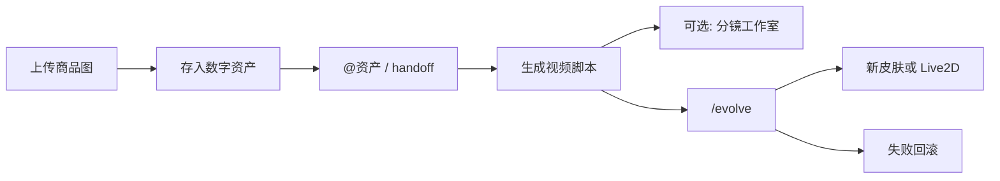

# WodeAppX 推广 Showcase 方案（评估用）

> **状态：** 方案草案（v2：主流程改为「入库 → @ → 视频脚本」；自进化改为皮肤/Live2D + 斜杠触发）  
> **Last updated:** 2026-07-31  
> **品牌：** 开源 / OSS / 对外传播默认 **WodeAppX**（素材统一用 WodeAppX）
> **相关文档：** [`SELF_EVOLUTION_DESIGN.md`](SELF_EVOLUTION_DESIGN.md) · [`AGENT_MINIMAL_CONTEXT.md`](AGENT_MINIMAL_CONTEXT.md) · [`CAPABILITIES.md`](CAPABILITIES.md) · [`OSS_TEST_PACKAGE.md`](OSS_TEST_PACKAGE.md)

---

## 0. 一句话定位

WodeAppX 不是「又一个聊天框」，而是：**本机桌面 Agent + 数字资产可 @ 引用 + 视频脚本/工作台 + 有明确入口的自进化（皮肤 / Live2D）**。

推广主片靠一条更贴真实用法的链路：

> **上传商品图 → 存入数字资产 → `@资产` 生成视频脚本 →（可选）打开分镜工作室**  
> **再加一幕：`/evolve` 换皮肤或唤醒 Live2D 伴侣，改坏可回滚。**

无限画布降为加分短片，不再占主片中段。

---

## 1. 目标与非目标

### 1.1 目标

| # | 目标 | 可验收结果 |
|---|------|------------|
| G1 | 有一套固定剧本，任何人按稿能复现同一 Wow 点 | `SHOWCASE` 剧本 + 素材包 + 验收矩阵 |
| G2 | 录屏 / 路演 / OSS README 共用同一叙事 | 中英提示词各一版；品牌分轨 |
| G3 | 自进化成为差异化卖点，且意图入口明确 | 斜杠/按钮触发；必演「换皮肤或 Live2D + 失败回滚」 |
| G4 | 演示成本可控（积分、时间、翻车率） | 单次完整演示 ≤ 8 分钟；主片以**脚本交付**为主，真出片可选 1 镜 |

### 1.2 非目标（本期不做 / 不宣传）

- 不把 **Phase 2 A/B Supervisor 热切换** 当成已交付能力宣传（见自进化设计 M2，未开始）。
- 不演示 Agent **无人值守批量** 多分镜视频生成（契约：注入 + 打开工作室，用户点生成）。
- 不把能力中心里「待接入」渠道（飞书/企微/钉钉推送）当主卖点。
- 不做完整营销站 / 广告投放方案；本文件只管「产品可演示资产与工程落地」。
- 不在演示中暴露真实 API Key、手机号、客户数据。

### 1.3 成功标准（评估用）

| 指标 | 达标线 |
|------|--------|
| 冷启动演示成功率（按剧本手测） | ≥ 4/5 次完整走通 |
| 单次完整演示时长 | 4–8 分钟（剪辑版 60–90s） |
| 观众能复述的差异化点 | ≥ 2 条（建议：工作台内置 + 自进化可回滚） |
| 自进化失败路径 | 100% 可演示回滚（不得留坏代码） |

---

## 2. 受众与叙事分轨

| 轨道 | 受众 | 品牌文案 | 强调点 | 弱化点 |
|------|------|----------|--------|--------|
| A. OSS / GitHub | 开发者、自托管 | **WodeAppX** | 开源、本机 Agent、MCP、自进化门禁 | 国内支付细节 |
| B. 官网 / 下载页 | 内容生产、建站 | WodeAppX | 自定义 Agent、模型随便搭、本地优先 | 改源码细节 |
| C. 投资/路演 | 决策者 | 按场合选 A 或 B | 30s 叙事 + 90s 录屏 | 技术细节 |
| D. 内部验收 | 工程/QA | 仓内 codename `wodeappx` | 验收矩阵、负例、积分消耗 | 营销话术 |

**统一电梯稿（30 秒）：**

> WodeAppX 是装在电脑上的 AI 工作台：商品图进数字资产，用 @ 点名去做视频脚本；嫌界面不够个性，打 `/evolve` 换皮肤或请出 Live2D 伴侣——改之前有快照，改坏了自动回滚。

---

## 3. 能力库存：哪些适合进 Showcase

### 3.1 主推（P0，一条龙必用）

| 能力 | 用户可见名 | 入口 / ID | 演示可信度 | 注意 |
|------|------------|-----------|------------|------|
| 上传 + 入库 | 商品/图片资产 | `wodeapp.product.save` / `wodeapp.image_asset.save` | 高 | 已有工具活动文案「保存商品到数字资产」 |
| @ 引用资产 | Composer mention | `asset:…` mention + handoff | 高 | 商品库 handoff 已有「生成视频 → 生成5条视频脚本」 |
| 视频脚本 | 视频智能体 | `video-generation` | 高 | **主片交付脚本**；打开工作室/出片为加时 |
| 皮肤 | 外观 | `wodeapp-skins`（现有 `default` / `classic-blue`） | 高 | 自进化可「新增第三套皮肤」作 Wow |
| 自进化入口 | `/自进化` / `/evolve` | OpenCode command + skill `wodeappx-self-evolution` | 中 | 斜杠为主；须确认后 snapshot/verify |
| 自进化门禁 | M1 | `self-evolve-guard` + skill | 中高 | 开发版热更新；打包版勿夸大 |

### 3.2 加分项（P1）

| 能力 | 何时用 | 注意 |
|------|--------|------|
| Live2D 伴侣 | 自进化高潮 / 独立短片 | 代码已有，`WODEAPPX_LIVE2D_ENABLED = false` 硬关；演示前需产品决策重开或本地包模型 |
| 打开分镜工作室 + 1 镜出片 | 路演加时 | 仍遵守「确认后再生成」 |
| 无限画布 | 衍生短片 S0 | 从主片中段撤出，避免冲淡「资产 → @」叙事 |
| 批量出图 | 电商向加 20s | 可接在入库后，非必须 |
| 短剧 / 多模型 / Skill 物化 / Computer Use / PDF | 同前版 | 独立短片 |

### 3.3 暂不进主片（P2）

- 飞书智能体（需授权就绪标志）
- 能力中心渠道「待接入」卡片
- 打包版渲染层覆盖目录（未完整交付时勿当已上线）
- A/B Supervisor（M2 未开始）
- 自进化改鉴权/扣费/门禁本身

### 3.4 对外诚实边界（口播禁用词）

| 禁止说法 | 正确说法 |
|----------|----------|
| 「它会自动生成整部短视频」 | 「先根据数字资产写出视频脚本；要出片时你确认再生成」 |
| 「随便说一句就会改自己的代码」 | 「只有 `/evolve`（或明确自进化入口）才会进入改自身流程」 |
| 「改完自己立刻换内核、不用重启」 | 「皮肤/文案类可热更新；主进程需重启；有快照可回滚」 |
| 「安装包里随便改任何文件」 | 「不碰签名包；可进化的是渲染层/覆盖目录（规划中）」 |
| 「Live2D 已默认对所有用户开启」 | 按实际开关与模型授权说明 |

### 3.5 产品意见（为何采纳本叙事）

| 你的点子 | 评价 | 落地要点 |
|----------|------|----------|
| 上传 → 数字资产 → `@` → 视频脚本 | **强烈建议作主片**。比「出图→画布→分镜」更贴现有 handoff，Wow 在「资产可被点名复用」，不是一次性聊天附件。 | 彩排走真实 `@` 或资产卡片「做成视频/生成视频」handoff，避免只口述。 |
| 自进化 = 多皮肤 | **优先做**。已有皮肤框架，第三套皮肤增量小、肉眼可见、适合 `/evolve` 白名单。 | 冻结可改文件：`wodeapp-skins.ts`、对应 CSS、主 chrome；禁止碰 guard。 |
| 自进化 = Live2D 人物出场 | **酷，但作第二阶段**。已有组件却硬关；CDN 模型、性能、品牌形象都要定。 | 演示可选：`/evolve`「启用 Live2D 伴侣并设问候语」；模型尽量本地化，少依赖 jsDelivr。 |
| 快捷触发（斜杠/按钮） | **必须做**。自然语言「帮我改一下界面」太容易误进自进化；显式入口才敢推广。 | 推荐 **`/evolve` 斜杠命令为主**，设置页或标题栏次要按钮为辅；命令只预填意图 + 走确认，不跳过 snapshot。 |

---

## 4. 四幕 Showcase 剧本（完整版 · v2）

### 4.0 总编排

```text
幕1 上传入库 (40s) → 幕2 @资产生成视频脚本 (70s) → 幕3（可选）打开工作室/1镜 (60s)
→ 幕4 /evolve 换皮肤或 Live2D + 失败回滚 (90s)
可选片头 5s + CTA 10s
完整路演：~6–8 min（含等待；可跳过幕3省积分）
剪辑传播：60–90s（突出 @ 与 /evolve 两个手势）
```



**固定环境：**

- 机器：干净演示账号；积分预充；关闭无关通知
- 构建：能力一条龙可用 OSS 包；**幕 4 优先开发版**（热更新可见）
- 工作区：演示专用目录，自进化期间独占
- 素材：§6；商品名与资产 `name` 写死，便于 `@` 与脚本一致

---

### 幕 1 — 上传入库：「附件变可复用资产」

| 项 | 内容 |
|----|------|
| **时长** | 30–45s |
| **入口** | 默认会话 / 图片智能体；Composer 上传商品图 |
| **用户提示词（中）** | 「把这张商品图存进数字资产（商品库），名称用『演示·阿尔法杯』，方便我后面 @ 它做视频脚本。」 |
| **用户提示词（EN）** | "Save this product photo into digital assets (product library) as 'Demo Alpha Cup' so I can @mention it for video scripts." |
| **操作** | 上传 → Agent 调 `product.save` / `image_asset.save` → 资产列表可见 |
| **Wow 点** | 不是聊完就丢的附件，而是库里的一等公民 |
| **旁白** | 「先入库，后面才能点名复用。」 |
| **验收** | 数字资产中出现该商品/图片；可被 mention |
| **负例** | 只回「已收到图片」却未入库 → 判失败 |
| **积分预算** | 极低（入库为主；可不做出图） |

---

### 幕 2 — @ 资产 → 视频脚本（主 Wow）

| 项 | 内容 |
|----|------|
| **时长** | 60–80s |
| **入口** | Composer `@` 选中该资产，或资产卡片 handoff「生成视频」 |
| **用户提示词（中）** | 「@演示·阿尔法杯 根据这个商品写 5 条可拍摄的短视频脚本（每条含镜头目的、口播要点、画面提示），先不要提交视频生成。」 |
| **用户提示词（EN）** | "@Demo Alpha Cup Write 5 shootable short-video scripts for this product (shot goal, VO beats, visual notes). Do not submit video generation yet." |
| **对齐现有 handoff** | 商品库 → 视频智能体文案已是「用商品「…」生成5条视频脚本：」——演示尽量走同一路径 |
| **Wow 点** | **@ 手势**清晰；脚本结构化可读；明确「先脚本、后出片」 |
| **旁白** | 「点名资产，而不是重新上传一遍。」 |
| **验收** | 5 条脚本落在对话（或可打开的工作台）；未自动批量烧视频积分 |
| **负例** | 忽略 @ 资产、编造无关商品；或直接批量 `video_generate` |
| **积分预算** | 低（纯文本脚本） |

---

### 幕 3 —（可选加时）分镜工作室 / 1 镜

| 项 | 内容 |
|----|------|
| **时长** | 45–70s |
| **触发** | 「把第 1 条脚本打开成分镜工作室，只准备 1 个镜头，等我点生成。」 |
| **Wow 点** | 脚本 → 专业工作台；人机共控 |
| **验收 / 负例 / 备用** | 同旧版幕 3（shareDoc、标签纪律、B-roll） |
| **路演策略** | 网络不稳或积分紧时 **整幕可剪**，主片仍成立 |

---

### 幕 4 — `/evolve`：「有入口的个性化」

原则：只演渲染层可见改动 + 完整安全闭环；**必须从显式入口进入**。

#### 4.A 成功路径 A — 新皮肤（推荐默认）

| 项 | 内容 |
|----|------|
| **触发** | 输入 `/evolve`（或点「自进化」按钮）→ 命令展开预填 |
| **预填意图** | 「新增一套『暗夜工坊』皮肤（或演示主题名），可在外观切换里选到，并设为当前皮肤。」 |
| **改动白名单** | `wodeapp-skins.ts`、皮肤 CSS/chrome；扩展 `WodeAppSkinId` |
| **Wow 点** | 切换器里多出一枚皮肤；主界面配色结构变化 |
| **流程** | 确认方案 → `snapshot` → 改 → `verify` → 热更新可见 → `version commit` |

#### 4.B 成功路径 B — Live2D 出场（进阶）

| 项 | 内容 |
|----|------|
| **前置** | 产品批准临时打开 `WODEAPPX_LIVE2D_ENABLED`，或 `/evolve` 任务就是「安全打开开关 + 本地问候语」 |
| **预填意图** | 「启用 Live2D 助手，问候语改成『你好，我是演示版小雪』，默认显示在右下角。」 |
| **Wow 点** | 人物滑出；与「只是换 CSS」形成记忆点 |
| **风险** | CDN/模型授权、首屏卡顿、品牌形象；失败则回退只演皮肤 |
| **建议排期** | S3+；主片可先只用 4.A，Live2D 单独短片 |

#### 4.C 失败路径（必演）

同前：注入 typecheck 失败 → `verify` FAIL → `rollback` → 报告已恢复。

#### 4.D 对外分层话术

| 环境 | 可说 | 不可说 |
|------|------|--------|
| 开发版 | `/evolve`、皮肤、Live2D（若开）、快照回滚 | 无人值守改内核上架 |
| OSS 安装包 | 入库 + @ + 脚本 | 未交付前不吹安装包内完整自进化 |
| 商业包 | 「外观可进化、改坏可恢复」 | 深挖改 vendor |

---

### 4.5 自进化快捷入口设计（建议实现）

目标：让观众和用户都明白——**只有主动进入自进化，才会改 WodeAppX 自身**。

| 方案 | 做法 | 优劣 | 建议 |
|------|------|------|------|
| **A. 斜杠命令 `/evolve`** | `.opencode/commands/evolve.md`（或中英别名 `/自进化`）预填：确认门槛说明 + 可选意图模板（换皮肤 / 开 Live2D / 改文案） | 与 OpenCode 命令模型一致；Composer 原生；可进调度器纪律 | **P0 主入口** |
| **B. 标题栏/设置「自进化」按钮** | 点击等价于插入 `/evolve` 或打开说明面板（最近 version log、一键回滚说明） | 路演更好找；怕误点则二次确认 | **P1 辅助** |
| **C. 仅自然语言** | 「帮我改皮肤」也走 skill | 入口模糊，误触发与推广口径冲突 | **降级**：可识别但应提示「请改用 /evolve」 |

**命令稿约束（写进 command 文件）：**

1. 第一条回复必须复述：将改哪些文件、是否触及保护清单、需要用户明确同意。  
2. 同意前不得 `snapshot` 以外的写操作。  
3. 强制走 `wodeappx-self-evolution` skill（snapshot → verify → rollback/version）。  
4. 默认推荐意图模板限白名单：皮肤 / 欢迎文案 / Live2D 开关与问候语。  

**不建议：** 全局浮动「一键进化」无确认直接改代码。

---

## 5. 衍生短片（可选）

| ID | 标题 | 主能力 | 适合轨道 |
|----|------|--------|----------|
| S0 | 入库后再整理到无限画布 | 画布智能体 | 设计向 |
| S1 | 扔 PDF 说明书 → 卖点 → 入库 | PDF + 资产 | B 电商 |
| S2 | 多模型同一问题对比 | 多模型 | A 开发者 |
| S3 | Skill 物化应用 | 创建智能体 | A/B |
| S4 | Computer Use | 本机操控 | 谨慎路演 |
| S5 | `/evolve` + Live2D 专场 | Live2D | 传播向 |
| S6 | version log / restore | 版本史 | A 硬核 |

---

## 6. 素材包规范（实现时落地目录建议）

建议目录（评估通过后创建，本方案阶段可先占位）：

```text
wodeappx/docs/showcase/
  README.md                 # 怎么跑演示
  scripts/
    demo-prompts.zh.md
    demo-prompts.en.md
    self-evolve-fail-demo.mjs   # 注入坏改 → verify → rollback
  fixtures/
    product-hero.jpg            # 固定商品图
    product-name.txt            # 官方商品名（与入库 name / @ 一致）
    video-script-brief.md       # 期望脚本结构（镜头/口播/画面）
  acceptance/
    matrix.md                   # 正例/负例矩阵
  commands/
    evolve.md                   # `/evolve` 命令稿（实现时同步到 .opencode/commands）
  recording/
    shot-list.md                # 录屏分镜
    vo-script.zh.md             # 旁白
```

### 6.1 商品图 fixture 要求

- 单主体、背景干净、无水印、无隐私信息
- 长边建议 ≤ 2048（与桌面上传规范化一致）
- 授权：可商用或自制
- **入库名写死**（如 `演示·阿尔法杯`），与幕 2 `@` 文案一致

### 6.2 脚本验收结构（幕 2）

每条脚本至少含：镜头目的、口播要点、画面提示；明确标注「未提交视频生成」。

---

## 7. 工程落地工作分解（供评估排期）

### Phase S0 — 文档与剧本冻结（0.5–1 人日）

- [ ] 确认 v2 主叙事：入库 → @ → 脚本；画布降级短片
- [ ] 确认自进化默认演「新皮肤」；Live2D 是否进主片或仅 S5
- [ ] 确认 `/evolve` 为唯一推广口径入口

**产出：** 本方案「已批准」；品牌分轨确认。

### Phase S1 — 素材 + 手跑验收（1–2 人日）

- [ ] fixtures + 真实走通 `@` / handoff「生成视频脚本」
- [ ] 填写耗时、翻车点；更新 matrix

### Phase S2 — `/evolve` 命令 + 自进化演示脚本（2–3 人日）

- [ ] 落地 `.opencode/commands/evolve.md`（及中文别名若需要）
- [ ] 命令强制挂 `wodeappx-self-evolution` 流程说明
- [ ] `self-evolve-fail-demo.mjs` +（可选）「新增皮肤」正向 demo 清单
- [ ] （P1）设置页/标题栏「自进化」按钮 → 插入 `/evolve`

### Phase S3 — 皮肤 / Live2D 产品化（按需）

| 项 | 价值 | 复杂度 |
|----|------|--------|
| 预设第三套演示皮肤骨架（空壳也可由 evolve 填充） | 降低现场改动量 | 低 |
| 能力中心「立即使用」跳转 | 降迷路 | 低–中 |
| Live2D：开关策略、本地模型、性能预算 | 传播记忆点 | 中–高 |
| 打包版覆盖目录 MVP | 安装包也能演 | 高 |

### Phase S4 — 传播资产（1–3 人日）

- [ ] 主片突出两个手势：`@` 与 `/evolve`
- [ ] OSS README / 下载页 CTA
- [ ] 中英字幕

---

## 8. 录屏分镜表（剪辑版 90s）

| 秒 | 画面 | 字幕/旁白 |
|----|------|-----------|
| 0–5 | 品牌锁定 WodeAppX | 产品名 |
| 5–25 | 上传商品图 → 数字资产列表出现 | 先入库，才能复用 |
| 25–50 | Composer `@` 资产 → 5 条视频脚本 | 点名资产，生成可拍脚本 |
| 50–65 | （可选快切）打开分镜工作室 | 要出片再确认 |
| 65–82 | `/evolve` → 新皮肤切换（或 Live2D 滑出）→ 红字失败回滚 | 主动进化，摔不坏 |
| 82–90 | CTA | 下载 / GitHub |

---

## 9. 验收矩阵（模板）

| Case ID | 幕 | 类型 | 步骤摘要 | 期望 | 实测 |
|---------|----|------|----------|------|------|
| C1-P | 1 | 正 | 上传并入库 | 资产列表可见且可 @ | |
| C1-N | 1 | 负 | 上传后未要求入库 | 不得假装已在库中 | |
| C2-P | 2 | 正 | @ 资产要 5 条脚本 | 结构化脚本；不自动出片 | |
| C2-N | 2 | 负 | @ 后忽略资产 | 判失败 | |
| C3-P | 3 | 正 | 可选：1 镜工作室 | shareDoc + 确认后生成 | |
| C3-N | 3 | 负 | 自动批量出片 | 判失败 | |
| C4-P | 4 | 正 | `/evolve` 新皮肤 | verify PASS + 可切换 | |
| C4-N | 4 | 负 | 注入类型错误 | rollback + verify PASS | |
| C4-L | 4 | 可选 | Live2D 启用 | 人物可见；可关 | |

与 [`AGENT_CAPABILITY_TESTING.md`](AGENT_CAPABILITY_TESTING.md) 的关系：能力路由不变式继续以该文档为准；本矩阵只覆盖 **Showcase 路径**，不替代全量能力测试。

---

## 10. 风险登记册

| ID | 风险 | 等级 | 缓解 |
|----|------|------|------|
| R1 | 视频出片超时 | 中 | 主片只交脚本；幕 3 可剪；B-roll 备用 |
| R2 | 自进化误伤共享工作区 | 高 | 演示专用目录；`/evolve` 白名单；独占 |
| R3 | 自然语言误触发自进化 | 高 | 推广只教 `/evolve`；自然语言提示改用斜杠 |
| R4 | Live2D CDN/性能/形象翻车 | 中 | 主片默认皮肤；Live2D 独立短片；本地模型 |
| R5 | @ mention / handoff 路径不熟导致演示卡壳 | 中 | 彩排走资产卡片「生成视频」；写死操作步骤 |
| R6 | 夸大未交付能力 | 高 | §3.4 禁用词 checklist |
| R7 | 品牌混用 | 低 | 两套字幕 |

---

## 11. 成本与资源（粗估，供评估）

| 阶段 | 人力 | 现金成本 | 备注 |
|------|------|----------|------|
| S0 冻结 | 0.5–1d | 0 | 含是否上 Live2D |
| S1 素材验收 | 1–2d | 低 | |
| S2 `/evolve` + 回滚脚本 | 2–3d | 0 | **相对 v1 增加命令入口** |
| S3 皮肤骨架 / Live2D | 1–5d | 0 | Live2D 单列 |
| S4 录屏 | 1–3d | 可选外包 | |
| 单次彩排 | 0.5d | 脚本几乎零视频积分 | 出片加时另算 |

**建议决策：**

1. **批 S0–S2**：主片可拍；`/evolve` 必须先于大规模宣传。  
2. **自进化默认演新皮肤**；Live2D 另批。  
3. **打包版自进化** 仍并入 `SELF_EVOLUTION_DESIGN` §9，不阻塞主片（开发版录幕 4）。

---

## 12. Go / No-Go 检查单（评估会用）

### 可以开工（Go）若：

- [ ] 同意主叙事：入库 → @ → 视频脚本（画布非主片）
- [ ] 同意自进化主入口为 `/evolve`（按钮仅辅助）
- [ ] 同意默认演「新皮肤」；Live2D 单独决策
- [ ] 有演示账号；幕 3 出片可裁

### 应暂缓（No-Go / 拆分）若：

- [ ] 强依赖安装包内 Live2D/自进化但未交付 → 幕 4 用开发版或降级
- [ ] 必须主片自动批量出视频 → 与契约冲突
- [ ] 不愿做显式入口、坚持「随便说说就改自己」→ 不建议对外推广自进化

---

## 13. 结论（给评估人）

| 问题 | 建议 |
|------|------|
| 主流程用你提的入库→@→脚本？ | **采纳。** 比画布中段更贴现有 handoff，积分更省。 |
| 自进化用皮肤 + Live2D？ | **皮肤优先；Live2D 二期。** 已有皮肤框架；Live2D 代码在但硬关。 |
| 要不要斜杠/按钮？ | **要，且斜杠为主。** 没有显式入口就不要大力宣传自进化。 |
| 最小可交付？ | **S0–S2 + 90s 剪辑（可无幕 3、无 Live2D）。** |
| 最大风险？ | **误触发自进化 + Live2D 翻车 + 口径夸大。** |

**总评：建议按 v2 做；S0–S2 必做，Live2D/幕 3/画布短片可选。**

---

## 14. 评估通过后的下一步（实现入口）

1. 本文件标「已批准」；文档索引已含本页。  
2. 实现 `/evolve` command + 与 self-evolution skill 对齐。  
3. 手跑 C1/C2/C4；需要再开幕 3 / Live2D。  
4. 创建 `docs/showcase/` fixtures 与录屏。  
5. （可选）标题栏自进化按钮、第三套皮肤骨架。

（未批准前：不改产品默认开关、不重开 Live2D 硬关，除非评估明确要求。）
